# DSO202 - Practical 1 Report

**Setting Up a Local Kubernetes Cluster with kind, and Deploying First Workloads**

| | |
| --- | --- |
| Module | DSO202: Scaling, Orchestration, Monitoring & Observability |
| Programme | BE in Software Engineering |
| Practical | 1 of 10 |
| Date carried out | 11 August 2026 |
| Repository | `dso202-practical-01/` |

---

## 1. Objective

The purpose of this practical was to build, from nothing, the local Kubernetes
environment that the remaining nine practicals in this module depend on, and to
create, inspect, deliberately break and repair the five categories of Kubernetes
object that most workloads are assembled from.

Concretely, the practical required me to:

- create a **three-node** cluster on my own laptop using kind (Kubernetes IN
  Docker), rather than a single-node cluster, so that scheduler placement is
  observable rather than hidden;
- identify each control-plane and node component as a real object that can be
  listed, described and read, instead of as a diagram from the lecture;
- partition the cluster with a **Namespace**, and constrain it with a
  **ResourceQuota** and **LimitRange**;
- deploy a static nginx web server first as a bare **Pod**, then as a
  **Deployment**, and reach it through both a **ClusterIP** and a **NodePort**
  Service;
- operate `kubectl` throughout for creation, inspection and troubleshooting; and
- prove reproducibility by destroying every object and rebuilding it from the
  repository with a single command.

The application is deliberately trivial so that attention stays on the
Kubernetes objects rather than on application code.

**Descriptor sections covered.** Unit I: 1.1, 1.2.1, 1.2.2, 1.2.3, 1.2.4, 1.3.1,
1.3.2, 1.3.3, 1.4.1, 1.5.1, 1.5.3.

**Learning outcomes addressed.**

| LO | Statement | Where met |
| --- | --- | --- |
| LO1 | Core concepts and architecture of Kubernetes | §3.3 |
| LO2 | Deploy and manage applications using various resource types | §3.5, §3.6, §3.7 |
| LO3 | Operate kubectl for management and troubleshooting | Throughout; concentrated in §3.3, §3.5.2, §3.6.4 |
| LO5 (part) | Namespace-based multi-tenancy | §3.4 |

Persistent storage (LO4) is covered in Practical 2; the service-registry half of
LO5 is covered in Practical 6.

---

## 2. Environment

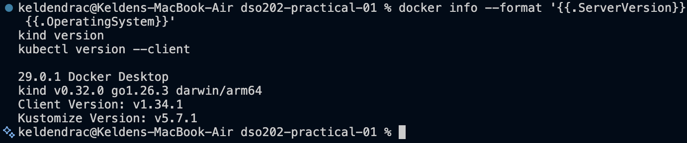

| Item | Value |
| --- | --- |
| Operating system | macOS 26.5.2 (build 25F84), Apple Silicon (arm64) |
| Docker | Docker Desktop, server version 29.0.1 |
| kind | v0.32.0 (go1.26.3, darwin/arm64) |
| kubectl | **v1.34.1** (Kustomize v5.7.1) |
| Cluster Kubernetes version | v1.36.1 (`kindest/node:v1.36.1`) |
| Node OS image | Debian GNU/Linux 13 (trixie) |
| Node kernel | 6.12.54-linuxkit (arm64) |
| Container runtime | containerd://2.3.1 |
| API server endpoint | `https://127.0.0.1:53952` (randomised per cluster) |

### 2.1 A note on version skew

kubectl is supported only within **one minor version** of the cluster it
addresses. This practical was carried out with **kubectl v1.34.1 against a
v1.36.1 cluster**, a two-minor skew that falls outside the supported window.

Every operation in this report succeeded, because the practical touches only
long-stable core APIs: `v1` for Pods, Services, Namespaces, ResourceQuotas and
LimitRanges; `apps/v1` for Deployments and ReplicaSets; `discovery.k8s.io/v1`
for EndpointSlices. None of these changed between 1.34 and 1.36. The combination
is nevertheless unsupported and is discussed in §5.

The cause and the fix are recorded in `README.md`. In short: Docker Desktop
installs its own older `kubectl` at `/usr/local/bin/kubectl`, which precedes
Homebrew's `/opt/homebrew/bin/kubectl` (v1.36.3) in `PATH`, so the older binary
silently wins.

---

## 3. Procedure and Observations

### 3.1 Repository structure

```
dso202-practical-01/
├── README.md
├── cluster/kind-cluster.yaml            # Listing 1
├── manifests/
│   ├── 00-namespace.yaml                # Listing 2
│   ├── 01-quota-and-limits.yaml         # Listing 3
│   ├── 02-pod-web.yaml                  # Listing 4
│   ├── 03-deployment-web.yaml           # Listing 5
│   ├── 04-service-clusterip.yaml        # Listing 6
│   ├── 05-service-nodeport.yaml         # Listing 7
│   └── 06-pod-client.yaml               # Listing 8
├── evidence/
└── report/practical-01-report.md
```

The manifests are numbered because `kubectl apply -f manifests/` applies a
directory in **lexical order**. The namespace must exist before the quota, and
the quota before any Pod, or admission fails.

> **Note on the companion file.** `DSO202_Practical1_Manifests.md` was not
> available to me, so all eight listings were written from the specifications
> described in the practical guide: node names and labels, quota and limit
> values, port numbers, probe behaviour and container names.

### 3.2 Stage 1 - Creating the three-node cluster

**What was done.** `kind create cluster --config cluster/kind-cluster.yaml`,
followed by verification that kind, kubectl and Docker all agreed the cluster
existed.

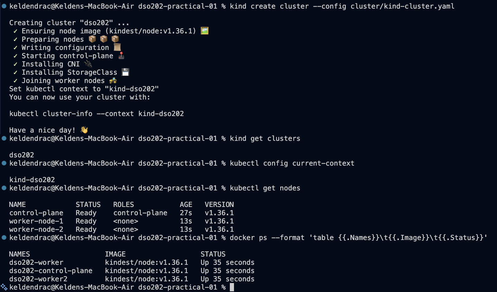

```
kubectl get nodes
NAME            STATUS   ROLES           AGE   VERSION
control-plane   Ready    control-plane   27s   v1.36.1
worker-node-1   Ready    <none>          13s   v1.36.1
worker-node-2   Ready    <none>          13s   v1.36.1

docker ps
NAMES                  IMAGE                  STATUS
dso202-worker          kindest/node:v1.36.1   Up 35 seconds
dso202-control-plane   kindest/node:v1.36.1   Up 35 seconds
dso202-worker2         kindest/node:v1.36.1   Up 35 seconds
```

**What this shows.** Each node carries **two different names**, and the
difference is the point of the screenshot. The *Docker container* name is chosen
by kind and follows the fixed pattern `<cluster>-control-plane` / `-worker` /
`-worker2`; kind offers no field to change it. The *Kubernetes Node object* name
is what the kubelet registers with the API server, and it **can** be changed:
`cluster/kind-cluster.yaml` patches the generated kubeadm configuration
(`InitConfiguration` / `JoinConfiguration` then `nodeRegistration.name`) to
produce `control-plane`, `worker-node-1` and `worker-node-2`. `ROLES` shows
`<none>` for the workers because kind assigns them no role label; the column is
derived from labels, not from anything intrinsic to the node.

### 3.3 Stage 2 - Inspecting the cluster and its components (LO1)

**What was done.** Located the control plane, listed nodes with extended
columns, read back the custom labels applied by Listing 1, and listed the
control-plane components as Pods.

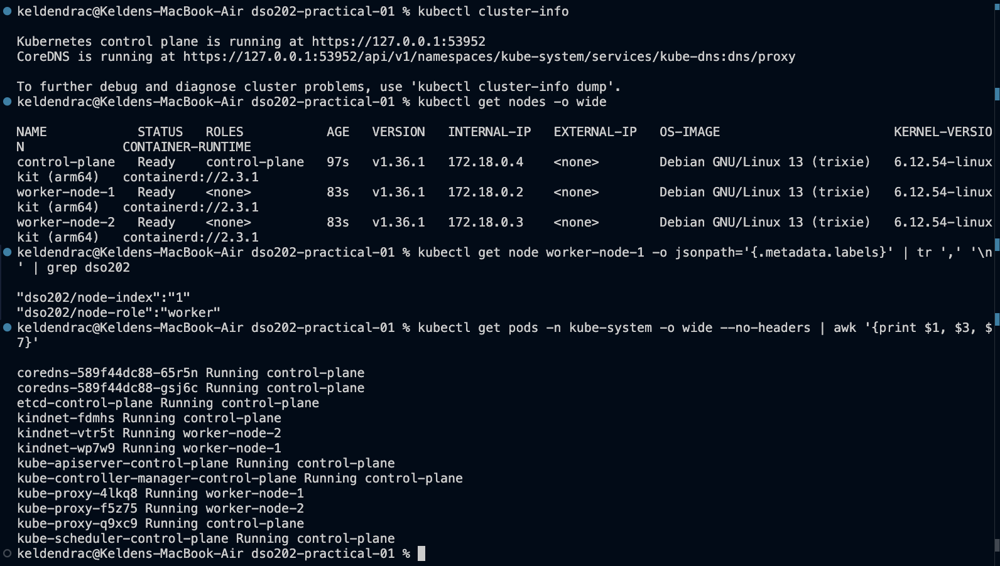

```
Kubernetes control plane is running at https://127.0.0.1:53952

NAME            STATUS  ROLES          AGE  VERSION  INTERNAL-IP  CONTAINER-RUNTIME
control-plane   Ready   control-plane  97s  v1.36.1  172.18.0.4   containerd://2.3.1
worker-node-1   Ready   <none>         83s  v1.36.1  172.18.0.2   containerd://2.3.1
worker-node-2   Ready   <none>         83s  v1.36.1  172.18.0.3   containerd://2.3.1

"dso202/node-index":"1"
"dso202/node-role":"worker"

coredns-589f44dc88-65r5n               Running  control-plane
coredns-589f44dc88-gsj6c               Running  control-plane
etcd-control-plane                     Running  control-plane
kindnet-fdmhs                          Running  control-plane
kindnet-vtr5t                          Running  worker-node-2
kindnet-wp7w9                          Running  worker-node-1
kube-apiserver-control-plane           Running  control-plane
kube-controller-manager-control-plane  Running  control-plane
kube-proxy-4lkq8                       Running  worker-node-1
kube-proxy-f5z75                       Running  worker-node-2
kube-proxy-q9xc9                       Running  control-plane
kube-scheduler-control-plane           Running  control-plane
```

**What this shows.** Three observations, which are the substance of LO1:

1. **`etcd`, `kube-apiserver`, `kube-controller-manager` and `kube-scheduler`
   appear exactly once, all on `control-plane`.** These are the control-plane
   components of Unit I 1.1.1, and they run as ordinary Pods that can be listed,
   described and have their logs read like any other workload.
2. **`kube-proxy` and `kindnet` appear three times, once per node.** Components
   that must run everywhere are deployed as DaemonSets. Their per-node instances
   are why a NodePort Service later works on every node (§3.7.3).
3. **`coredns` appears twice, both on `control-plane`.** The control-plane taint
   is tolerated by CoreDNS but not by ordinary application Pods, which is why
   every workload Pod in this practical landed on a worker.

The API server port (`53952`) is randomised at creation and must always be read
from `kubectl cluster-info` rather than from notes. The `INTERNAL-IP` values are
Docker network addresses, and `CONTAINER-RUNTIME` confirms containerd.

The two `dso202/*` labels confirm that the `labels:` field in Listing 1 was
applied by the kubelet at registration.

### 3.4 Stage 3 - Namespace, ResourceQuota and LimitRange (LO5)

**What was done.** Applied the namespace, made it the default for the current
context, applied the quota and limit range, then proved the LimitRange injects
defaults by running a Pod that declares no resources at all.

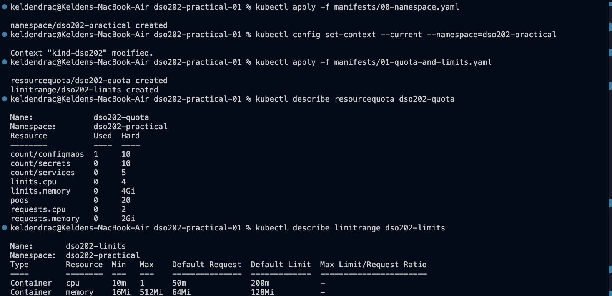

```
Resource          Used  Hard
count/configmaps  1     10
count/secrets     0     10
count/services    0     5
limits.cpu        0     4
limits.memory     0     4Gi
pods              0     20
requests.cpu      0     2
requests.memory   0     2Gi

Type       Resource  Min   Max    Default Request  Default Limit
Container  cpu       10m   1      50m              200m
Container  memory    16Mi  512Mi  64Mi             128Mi
```

Then, from `kubectl run limitrange-check --image=nginx:1.30-alpine
--restart=Never` with **no resource flags whatsoever**:

```
{"limits":{"cpu":"200m","memory":"128Mi"},"requests":{"cpu":"50m","memory":"64Mi"}}
```

**What this shows.** Two things.

First, `count/configmaps` already reports **1** before any work is done. Every
namespace is automatically given a `kube-root-ca.crt` ConfigMap holding the
cluster CA certificate, so Pods can verify the API server. A quota's `Used`
column counts everything in the namespace, including objects the cluster created
itself, which matters when diagnosing an unexpected `exceeded quota` error.

Second, all four resource values in the stored Pod came from the **LimitRange**,
not from the command. This demonstrates the companion relationship precisely:
the ResourceQuota caps `limits.cpu`, which makes declaring requests and limits
*mandatory* for every container in the namespace; without the LimitRange to
supply defaults, that imperative `kubectl run` would have been **rejected**.
Together they are the mechanism by which one tenant of a shared cluster cannot
consume it all.

### 3.5 Stage 4 - Pods (LO2, LO3)

#### 3.5.1 Declarative creation and idempotency

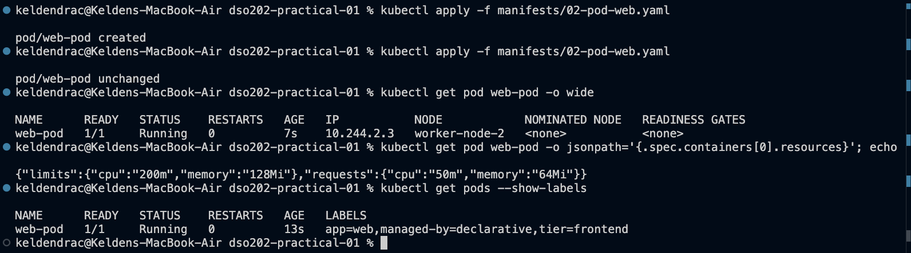

```
kubectl apply -f manifests/02-pod-web.yaml
pod/web-pod created

kubectl apply -f manifests/02-pod-web.yaml
pod/web-pod unchanged

NAME      READY  STATUS   RESTARTS  AGE  IP           NODE
web-pod   1/1    Running  0         7s   10.244.2.3   worker-node-2

{"limits":{"cpu":"200m","memory":"128Mi"},"requests":{"cpu":"50m","memory":"64Mi"}}

NAME      LABELS
web-pod   app=web,managed-by=declarative,tier=frontend
```

**What this shows.** The word **`unchanged`** on the second apply is the whole
point of declarative management: the command states a desired outcome, and when
that outcome already holds, nothing happens. Running it twice is safe, which is
what makes the same manifests usable by an automated reconciler such as ArgoCD
later in the module.

The Pod IP `10.244.2.3` comes from the `podSubnet` configured in Listing 1 and is
**not** reachable from the host. The node was chosen by the scheduler; the
manifest never named one. The resource values here came from the manifest rather
than the LimitRange, which is the correct approach for graded work.

#### 3.5.2 Troubleshooting commands (descriptor 1.3.3)

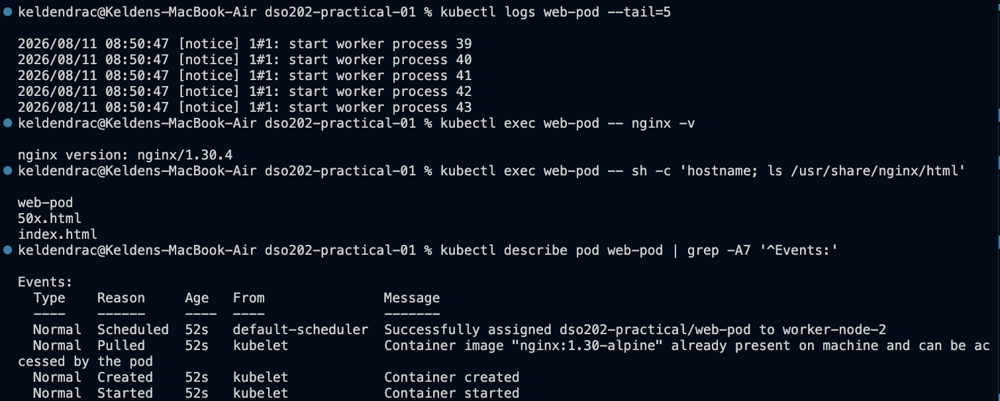

```
kubectl logs web-pod --tail=5
2026/08/11 08:50:47 [notice] 1#1: start worker process 39 ... 43

kubectl exec web-pod -- nginx -v
nginx version: nginx/1.30.4

kubectl exec web-pod -- sh -c 'hostname; ls /usr/share/nginx/html'
web-pod
50x.html
index.html

Events:
  Type    Reason     Age  From               Message
  Normal  Scheduled  52s  default-scheduler  Successfully assigned dso202-practical/web-pod to worker-node-2
  Normal  Pulled     52s  kubelet            Container image "nginx:1.30-alpine" already present on machine
  Normal  Created    52s  kubelet            Container created
  Normal  Started    52s  kubelet            Container started
```

**What this shows.** The `From` column maps the event timeline directly onto the
components listed in Unit I 1.1: **`default-scheduler` chose the node, and
`kubelet` did everything after that**. This is why the Events section is the
first place to look when a Pod misbehaves, not the last. The container's
hostname is the Pod name, and `Pulled` reports the image was *already present*
because the same image had been used earlier in the session.

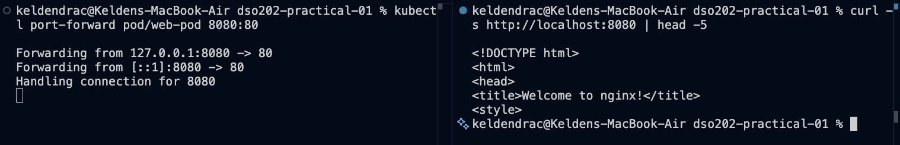

`kubectl port-forward pod/web-pod 8080:80` opened a tunnel from the host through
the API server to the Pod, and `curl http://localhost:8080` in a second terminal
returned the nginx welcome page while the first terminal logged `Handling
connection for 8080`. This is a debugging mechanism only, never a way to expose
an application, which is what the Services in §3.7 are for.

### 3.6 Stage 5 - Deployments (LO2)

#### 3.6.1 The ownership chain

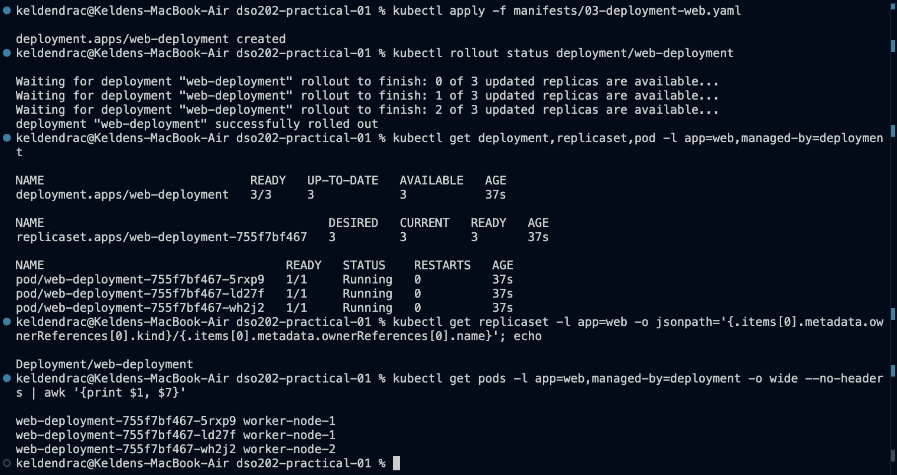

```
deployment.apps/web-deployment              3/3   3   3   37s
replicaset.apps/web-deployment-755f7bf467   3     3   3   37s
pod/web-deployment-755f7bf467-5rxp9         1/1   Running   0   37s
pod/web-deployment-755f7bf467-ld27f         1/1   Running   0   37s
pod/web-deployment-755f7bf467-wh2j2         1/1   Running   0   37s

Deployment/web-deployment          # ownerReference of the ReplicaSet

web-deployment-755f7bf467-5rxp9 worker-node-1
web-deployment-755f7bf467-ld27f worker-node-1
web-deployment-755f7bf467-wh2j2 worker-node-2
```

**What this shows.** Two naming rules are visible: the ReplicaSet name is the
Deployment name plus a **hash of the Pod template**, and each Pod name is the
ReplicaSet name plus a random suffix. Because the hash derives from the template,
*any* change to the template necessarily produces a new ReplicaSet, which is the
mechanism the rolling update in §3.6.3 relies on.

The `ownerReferences` query confirms the relationship from the API rather than
inferring it from the names. The three replicas were spread across both workers
(two on `worker-node-1`, one on `worker-node-2`) without the manifest naming any
node.

#### 3.6.2 Self-healing

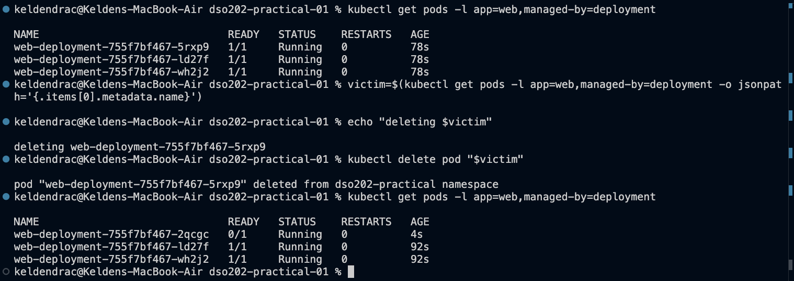

```
before:
web-deployment-755f7bf467-5rxp9   1/1   Running   0   78s
web-deployment-755f7bf467-ld27f   1/1   Running   0   78s
web-deployment-755f7bf467-wh2j2   1/1   Running   0   78s

deleting web-deployment-755f7bf467-5rxp9
pod "web-deployment-755f7bf467-5rxp9" deleted from dso202-practical namespace

after:
web-deployment-755f7bf467-2qcgc   0/1   Running   0   4s
web-deployment-755f7bf467-ld27f   1/1   Running   0   92s
web-deployment-755f7bf467-wh2j2   1/1   Running   0   92s
```

**What this shows.** This is the clearest illustration of **reconciliation** in
the practical. The replacement Pod `2qcgc` existed four seconds after the
deletion, carrying the same ReplicaSet prefix and a new random suffix. Nothing
instructed Kubernetes to create it; the ReplicaSet's control loop simply observed
that two Pods matched its selector where three were desired, and corrected the
difference. Note the actor is the **ReplicaSet**, not the Deployment: the
Deployment delegates replica management entirely.

This is precisely the property the bare Pod of §3.5 lacks. Delete `web-pod` and
nothing recreates it.

#### 3.6.3 Rolling update and rollback

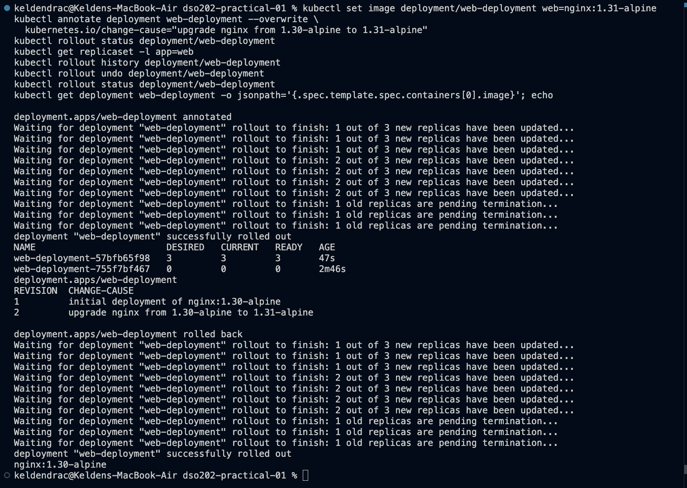

```
NAME                        DESIRED  CURRENT  READY  AGE
web-deployment-57bfb65f98   3        3        3      47s
web-deployment-755f7bf467   0        0        0      2m46s

REVISION  CHANGE-CAUSE
1         initial deployment of nginx:1.30-alpine
2         upgrade nginx from 1.30-alpine to 1.31-alpine

deployment.apps/web-deployment rolled back
nginx:1.30-alpine
```

**What this shows.** After changing the image to `nginx:1.31-alpine`, **two**
ReplicaSets exist: the new one at 3 replicas and the old one scaled to **zero**.
The old ReplicaSet is retained deliberately, so that a rollback requires no image
pull and no new object, only shifting replicas back. `kubectl rollout undo`
returned the image to `nginx:1.30-alpine`.

The `CHANGE-CAUSE` column is populated from the `kubernetes.io/change-cause`
annotation. Revision 1 is populated here because the annotation is set in the
manifest itself; setting it on every change is examinable good practice, since
without it the history records *that* something changed but not *why*.

*(Practical note: `kubectl annotate` required the `--overwrite` flag, because the
manifest already sets this annotation and `annotate` refuses to replace an
existing key without it.)*

#### 3.6.4 A deliberately failed rollout, and recovery

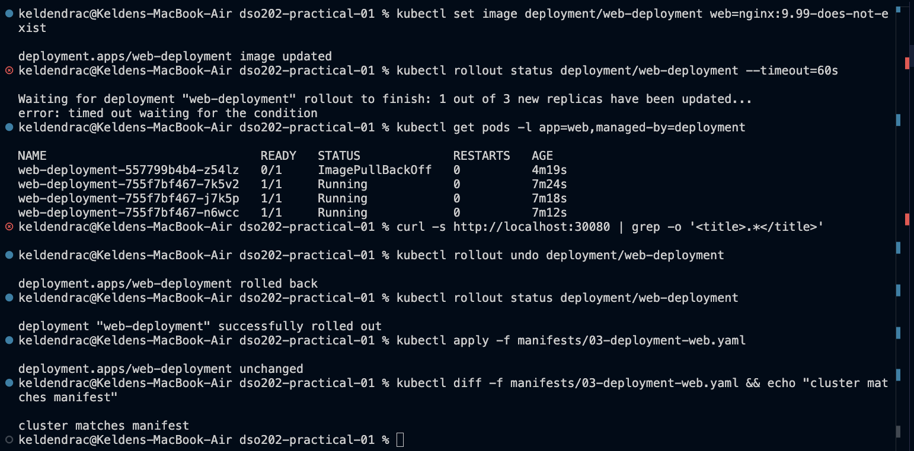

```
kubectl set image deployment/web-deployment web=nginx:9.99-does-not-exist
deployment.apps/web-deployment image updated

kubectl rollout status deployment/web-deployment --timeout=60s
Waiting for deployment "web-deployment" rollout to finish: 1 out of 3 new replicas have been updated...
error: timed out waiting for the condition

NAME                              READY  STATUS            RESTARTS  AGE
web-deployment-557799b4b4-z54lz   0/1    ImagePullBackOff  0         4m19s
web-deployment-755f7bf467-7k5v2   1/1    Running           0         7m24s
web-deployment-755f7bf467-j7k5p   1/1    Running           0         7m18s
web-deployment-755f7bf467-n6wcc   1/1    Running           0         7m12s

kubectl rollout undo deployment/web-deployment
deployment.apps/web-deployment rolled back
kubectl apply -f manifests/03-deployment-web.yaml
deployment.apps/web-deployment unchanged
kubectl diff -f manifests/03-deployment-web.yaml && echo "cluster matches manifest"
cluster matches manifest
```

**What this shows.** This is the most instructive result in the practical, and
what matters is **what did not happen**. The three healthy Pods were never
removed. Their ages (7m24s, 7m18s, 7m12s) predate the failed rollout entirely,
proving they survived it untouched, while the single new Pod sat in
`ImagePullBackOff`.

The cause is `maxUnavailable: 0` in the Deployment's `RollingUpdate` strategy.
Because the Deployment is forbidden from dropping below three ready replicas, and
the new Pod never became ready, the update simply **stalled**. A correctly
configured rollout strategy converts a bad release into a stalled release rather
than an outage. Had `maxUnavailable` been left at its 25% default, capacity would
have been reduced while the broken image failed to start.

`error: timed out waiting for the condition` is therefore the *correct* result
here, not a fault, a distinction discussed further in §5.

The final `kubectl diff` printing nothing, followed by `cluster matches
manifest`, is the proper closing check: it confirms the live object and the
committed manifest agree, so the repository is an accurate record of the running
state.

*(One deviation, visible in the screenshot: the `curl http://localhost:30080`
no-outage check produced no output at this point, because the NodePort Service is
not created until Stage 6. The Pod ages above serve the same evidential purpose.
External availability during a stalled rollout would be better demonstrated by
reordering Stage 6 before this step.)*

### 3.7 Stage 6 - Services (LO2)

#### 3.7.1 ClusterIP, DNS and load balancing

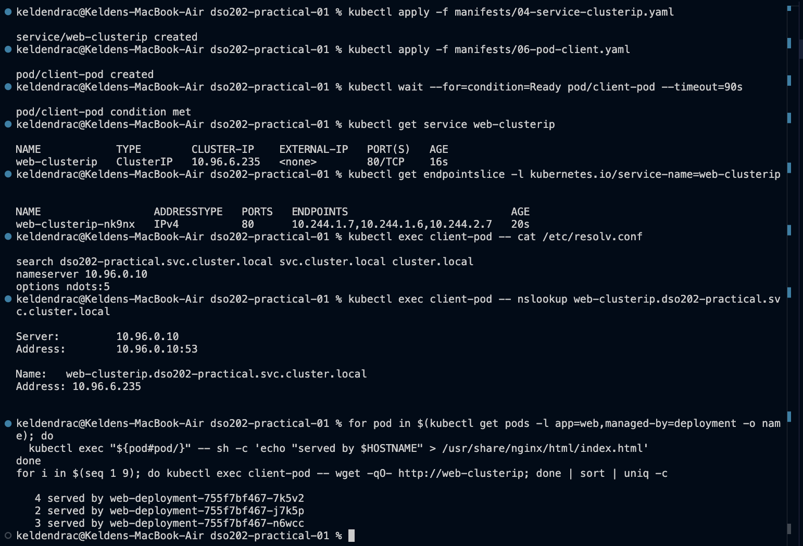

```
NAME            TYPE       CLUSTER-IP    EXTERNAL-IP  PORT(S)  AGE
web-clusterip   ClusterIP  10.96.6.235   <none>       80/TCP   16s

NAME                  ADDRESSTYPE  PORTS  ENDPOINTS
web-clusterip-nk9nx   IPv4         80     10.244.1.7,10.244.1.6,10.244.2.7

search dso202-practical.svc.cluster.local svc.cluster.local cluster.local
nameserver 10.96.0.10
options ndots:5

Name:    web-clusterip.dso202-practical.svc.cluster.local
Address: 10.96.6.235

   4 served by web-deployment-755f7bf467-7k5v2
   2 served by web-deployment-755f7bf467-j7k5p
   3 served by web-deployment-755f7bf467-n6wcc
```

**What this shows.** The EndpointSlice lists **exactly three** addresses, which
is the designed result. Both Services select `app=web,managed-by=deployment`, so
the stand-alone `web-pod`, which also carries `app=web`, is deliberately excluded
from the backend set. Had the selector been `app=web` alone, four endpoints would
have appeared and the load-balancing demonstration would have been muddied by an
unmanaged Pod.

DNS resolved the Service name to its **ClusterIP**, not to a Pod IP. The
`resolv.conf` search path explains why the short name `web-clusterip` also works
from inside this namespace: the resolver appends
`dso202-practical.svc.cluster.local` first. From another namespace,
`web-clusterip.dso202-practical` would be required. The fully qualified pattern
`<service>.<namespace>.svc.cluster.local` recurs in every later unit.

The nine requests were distributed across **all three** Pods (4 / 2 / 3),
confirming real load balancing rather than a fixed route. The per-Pod index pages
that make this visible were written with `kubectl exec`, and are therefore
invisible to the manifests. They were destroyed by the next rollout, which is
exactly why `exec` is a debugging tool and not a deployment mechanism.

#### 3.7.2 Readiness gates traffic

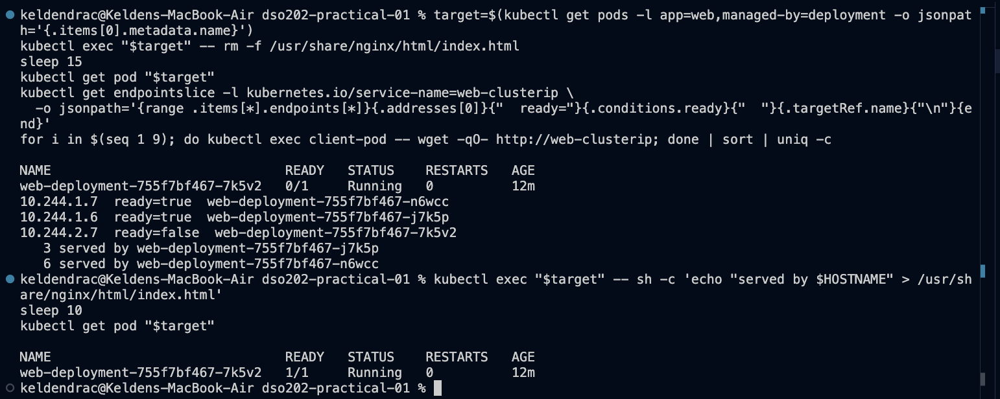

```
NAME                              READY  STATUS   RESTARTS  AGE
web-deployment-755f7bf467-7k5v2   0/1    Running  0         12m

10.244.1.7  ready=true   web-deployment-755f7bf467-n6wcc
10.244.1.6  ready=true   web-deployment-755f7bf467-j7k5p
10.244.2.7  ready=false  web-deployment-755f7bf467-7k5v2

   3 served by web-deployment-755f7bf467-j7k5p
   6 served by web-deployment-755f7bf467-n6wcc

after restoring index.html:
web-deployment-755f7bf467-7k5v2   1/1    Running  0         12m
```

**What this shows.** Deleting `/usr/share/nginx/html/index.html` makes the HTTP
readiness probe return 404. The Pod immediately went `0/1`, its endpoint
condition flipped to **`ready=false`**, and all nine subsequent requests were
answered by only the **other two** Pods.

Critically, `RESTARTS` stayed at **0**. Readiness and liveness are independent:
the readiness probe (HTTP GET `/index.html`) failed and gated traffic, while the
liveness probe (a TCP check on the same port) kept passing, so the container was
never restarted. This separation is what makes zero-downtime rollouts possible,
since a Pod can be removed from service without being killed.

Restoring the file returned the Pod to `1/1` within one probe period.

> **Correction to the practical guide.** The guide states that the failing Pod's
> address disappears from the `ENDPOINTS` column, leaving two addresses. It does
> not. That describes the older **Endpoints** API, which moved unready addresses
> into a separate `notReadyAddresses` field. **EndpointSlice**, which replaced it
> and which the guide itself uses elsewhere, keeps the address in the slice and
> sets `conditions.ready: false`. I verified this: the `ENDPOINTS` column still
> showed all three addresses. The gating is only visible via the conditions,
> which is why the JSONPath query above was used instead.

#### 3.7.3 NodePort and LoadBalancer

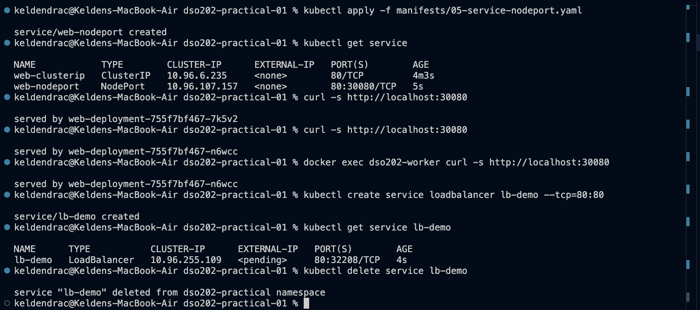

```
NAME            TYPE       CLUSTER-IP      EXTERNAL-IP  PORT(S)        AGE
web-clusterip   ClusterIP  10.96.6.235     <none>       80/TCP         4m3s
web-nodeport    NodePort   10.96.107.157   <none>       80:30080/TCP   5s

curl -s http://localhost:30080
served by web-deployment-755f7bf467-7k5v2
curl -s http://localhost:30080
served by web-deployment-755f7bf467-n6wcc

docker exec dso202-worker curl -s http://localhost:30080
served by web-deployment-755f7bf467-n6wcc

NAME      TYPE          CLUSTER-IP      EXTERNAL-IP  PORT(S)        AGE
lb-demo   LoadBalancer  10.96.255.109   <pending>    80:32208/TCP   4s
```

**What this shows.** `80:30080/TCP` reads as "port 80 on the Service, exposed as
port 30080 on every node". Two successive requests **from the host**, with no
port-forward running, were answered by different Pods. The request path is: host
port 30080, then the control-plane container's port 30080 (published by Listing
1), then `kube-proxy` on that node, then across the Pod network to a ready Pod on
a worker.

The `docker exec dso202-worker` call proves the node port is genuinely open on
**every** node, not only on the one whose port was published to the host. Only
the control-plane container's port was mapped, because that is all Listing 1
requested.

The `LoadBalancer` Service remained `<pending>` indefinitely. This is expected
rather than a fault: kind has no cloud provider to fulfil the external IP
request. Recognising this signature prevents wasted debugging time.

### 3.8 Stage 7 - Reproducibility and cleanup

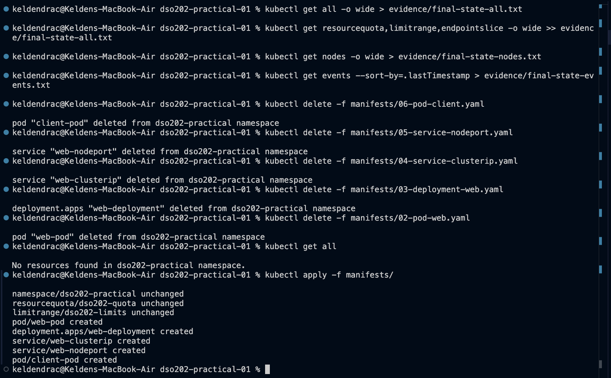

```
kubectl get all
No resources found in dso202-practical namespace.

kubectl apply -f manifests/
namespace/dso202-practical unchanged
resourcequota/dso202-quota unchanged
limitrange/dso202-limits unchanged
pod/web-pod created
deployment.apps/web-deployment created
service/web-clusterip created
service/web-nodeport created
pod/client-pod created
```

**What this shows.** Every workload object was deleted from **the same files
that created them**, which is the check that nothing was created outside version
control. The namespace then reported empty.

A **single command**, `kubectl apply -f manifests/`, then recreated the entire
body of work. The namespace, quota and limit range report `unchanged` because
they were never deleted; the five workload objects report `created`. This is the
strongest available evidence that the repository, not the laptop, holds the work.

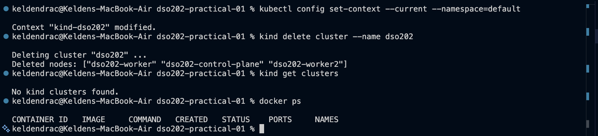

```
kind delete cluster --name dso202
Deleting cluster "dso202" ...
Deleted nodes: ["dso202-worker" "dso202-control-plane" "dso202-worker2"]

kind get clusters
No kind clusters found.

docker ps
CONTAINER ID  IMAGE  COMMAND  CREATED  STATUS  PORTS  NAMES
```

The cluster was then deleted and `docker ps` confirmed no `kindest/node`
containers remained. The node image (~1.27 GB) was retained deliberately, since
keeping it makes the next cluster creation substantially faster.

Final resource consumption before teardown, from `evidence/final-state-all.txt`:

```
count/services: 2/5, pods: 5/20,
requests.cpu: 210m/2, requests.memory: 272Mi/2Gi,
limits.cpu: 850m/4, limits.memory: 544Mi/4Gi
```

These reconcile exactly with the manifests: five Pods requesting 50m x 4 + 10m =
210m CPU and 64Mi x 4 + 16Mi = 272Mi memory.

---

## 4. Analysis

> The practical guide's §12.1 directs this section to "the review questions in
> section 21". The provided guide document ends at §12.1 and contains no §21, so
> no review questions were available to me. I have instead answered the
> questions the guide raises explicitly in its own numbered observations and
> examinable points.

**Why does each node have two names, and which one can be changed?**
The Docker container name is assigned by kind from the cluster name and cannot be
configured. The Kubernetes Node object name is what the kubelet registers with
the API server and *can* be set by patching kind's generated kubeadm
configuration. The distinction matters operationally: `docker` commands need the
container name (`docker exec dso202-worker ...`) while `kubectl` commands need
the Node object name (`kubectl describe node worker-node-1`). Using the wrong one
is a common early error.

**Why do some control-plane Pods appear once and others three times?**
Components that constitute the control plane, namely `etcd`, `kube-apiserver`,
`kube-controller-manager` and `kube-scheduler`, run only where the control plane
is, as static Pods on that node. Components that must service every node,
`kube-proxy` for packet forwarding and `kindnet` for the CNI, are deployed as
DaemonSets, which guarantee one Pod per node. This is why a NodePort Service
opens its port on all three nodes.

**Why is a ResourceQuota insufficient on its own?**
Setting a compute cap makes resource declarations mandatory: the API server
rejects any container that omits a request or limit for a capped resource. That
makes quick imperative commands fail. The LimitRange is the companion that
supplies defaults, so admission succeeds while the quota's guarantee is
preserved. §3.4 demonstrated this: a `kubectl run` with no resource flags was
admitted with all four values injected.

**What is the practical difference between a Pod and a Deployment?**
A bare Pod is scheduled once onto one node and stays there; it is never moved,
and nothing recreates it if it is deleted or its node fails. A Deployment
introduces a controller whose loop continuously reconciles observed state against
declared state. §3.6.2 showed this directly: a deleted Deployment-managed Pod was
replaced within four seconds, whereas `web-pod` would simply have ceased to
exist. The Deployment additionally manages *versioned* change through
ReplicaSets, giving rolling updates and rollback.

**Why does the ReplicaSet name change when the image changes?**
The ReplicaSet name is the Deployment name plus a hash of the Pod template. Since
the image is part of the template, changing it necessarily yields a new hash and
therefore a new ReplicaSet. This is the mechanism of the rolling update: the
Deployment shifts replicas from the old ReplicaSet to the new one, retaining the
old at zero replicas so that rollback needs no image pull.

**What does a Service actually do, and what does it not do?**
It provides a stable virtual IP and DNS name, and load-balances to the *ready*
Pods matching its selector. The EndpointSlice controller maintains the address
list; `kube-proxy` programs each node's forwarding rules; CoreDNS answers the
name. It does **not** proxy at the application layer, terminate TLS, route on
HTTP paths or hostnames, or retry. Those require an Ingress (Unit II 2.2) or a
service mesh (Unit II 2.5).

**What is the diagnostic signature of a Service selector mismatch, and how is it
distinguished from unready Pods?**
An empty EndpointSlice indicates a selector matching nothing. But a Service with
a *correct* selector and no *ready* Pods behaves identically from the client's
point of view. The two are distinguished by checking the `READY` column of
`kubectl get pods` first: if Pods exist and are ready but the slice is empty, the
selector is wrong; if the Pods are `0/1`, the probes are the problem. §3.7.2
showed the second case, where the address remained in the slice with
`ready=false`.

**Why are imperative changes unsuitable for graded work?**
`kubectl scale`, `kubectl set image` and `kubectl edit` change the live object
without changing the manifest, so the next `kubectl apply` silently reverses
them. The manifest is the record; imperative commands are debugging tools. This
is the same property ArgoCD enforces continuously in Unit IV, and `kubectl diff`
(§3.6.4) is the correct way to verify it holds.

---

## 5. Reflection

**The error that cost me the most time was one that was not an error at all.**
At Stage 5's deliberate-failure step, `kubectl rollout status
deployment/web-deployment --timeout=60s` printed `error: timed out waiting for
the condition` and returned a non-zero exit code. My instinct was that I had
misconfigured the Deployment, and I stopped to investigate. In fact this is the
*designed* outcome: the image `nginx:9.99-does-not-exist` cannot be pulled, so
the new Pod can never become ready, so a 60-second wait must expire.

What resolved it was reading the Pod list rather than the error message:

```
web-deployment-557799b4b4-z54lz   0/1   ImagePullBackOff   0   4m19s
web-deployment-755f7bf467-7k5v2   1/1   Running            0   7m24s
```

The **ages** were the decisive evidence, since the healthy Pods were older than
the failed rollout and so had never been touched. Confirming the root cause took
`kubectl describe pod`, whose Events section reported `failed to resolve
reference "docker.io/library/nginx:9.99-does-not-exist": not found`. The lesson I
will carry forward is that a command's exit status describes *that command's*
question ("did the rollout complete in 60 seconds?"), not the health of the
system; the cluster's own state is the authority, and `describe` is where it is
written down.

**The mistake I actually made was an environment one, and it was silent.** I ran
this work with `kubectl v1.34.1` against a `v1.36.1` cluster, a two-minor version
skew outside the supported plus-or-minus-one window. The cause is that Docker
Desktop installs its own `kubectl` at `/usr/local/bin`, which precedes Homebrew's
`/opt/homebrew/bin` in my `PATH`, so the older binary won even though a current
v1.36.3 was installed. `which -a kubectl` shows both. Nothing failed, because
only long-stable APIs were touched, but nothing warned me either, and that is the
uncomfortable part: a version mismatch of this kind produces no error until it
encounters a resource type or field that changed between versions, at which point
the failure would appear to be about the resource rather than about the tooling.
**What I would do differently** is verify `kubectl version` against the *server*,
not just `--client`, immediately after creating the cluster, and treat the PATH
shadowing as something to fix permanently in `~/.zshrc` rather than per-terminal.

**The second thing I would do differently is trust the documentation less and the
cluster more.** The guide states that a Pod failing its readiness probe
disappears from the EndpointSlice's `ENDPOINTS` column. When I ran it, all three
addresses were still listed, and I initially concluded the readiness probe was
not working. It was working. The guide describes the behaviour of the older
**Endpoints** API, whereas **EndpointSlice** retains the address and flips
`conditions.ready` to `false`. Querying the conditions directly showed
`ready=false` on exactly the broken Pod, and the traffic test confirmed it: nine
requests, zero of them served by that Pod. Reading the object rather than the
summary column is what settled it.

**What I found genuinely difficult** was keeping the distinction between
*declared* and *live* state clear while moving quickly. Several times I made a
change with `kubectl exec` or `kubectl set image`, then had to work out why it
had vanished. The per-Pod `index.html` files written in §3.7.1 were destroyed by
the next rollout; the imperative image change was reverted by the next `apply`.
Both are correct behaviour, and both felt like bugs until I internalised that the
manifest is the source of truth and everything else is transient. `kubectl diff`
became the command I trusted most, because it answers the only question that
matters at the end: does the cluster match what is committed?

**What remains unclear to me** is how rollout revision numbering behaves across
successive `rollout undo` operations. After rolling forward to 1.31, undoing,
breaking the image, and undoing again, I ended with the correct image but was no
longer confident which revision number corresponded to which template. When I
re-applied the manifest it reported `unchanged`, meaning the undo had already
restored a template identical to the committed one. I would like to understand
how `revisionHistoryLimit` interacts with repeated undos, and whether a revision
can be "used up" in a way that makes a specific historical state unreachable.

---

## 6. References

All pages accessed **11 August 2026**.

1. kind, *Quick Start*. https://kind.sigs.k8s.io/docs/user/quick-start/
2. kind, *Configuration* (node `labels`, `kubeadmConfigPatches`,
   `extraPortMappings`). https://kind.sigs.k8s.io/docs/user/configuration/
3. Kubernetes, *Namespaces*.
   https://kubernetes.io/docs/concepts/overview/working-with-objects/namespaces/
4. Kubernetes, *Resource Quotas*.
   https://kubernetes.io/docs/concepts/policy/resource-quotas/
5. Kubernetes, *Limit Ranges*.
   https://kubernetes.io/docs/concepts/policy/limit-range/
6. Kubernetes, *Pods*. https://kubernetes.io/docs/concepts/workloads/pods/
7. Kubernetes, *Deployments*.
   https://kubernetes.io/docs/concepts/workloads/controllers/deployment/
8. Kubernetes, *Configure Liveness, Readiness and Startup Probes*.
   https://kubernetes.io/docs/tasks/configure-pod-container/configure-liveness-readiness-startup-probes/
9. Kubernetes, *Service*.
   https://kubernetes.io/docs/concepts/services-networking/service/
10. Kubernetes, *EndpointSlices*.
    https://kubernetes.io/docs/concepts/services-networking/endpoint-slices/
11. Kubernetes, *DNS for Services and Pods*.
    https://kubernetes.io/docs/concepts/services-networking/dns-pod-service/
12. Kubernetes, *Version Skew Policy*.
    https://kubernetes.io/releases/version-skew-policy/

---

## Appendix - Evidence index

| File | Stage | Shows |
| --- | --- | --- |
| `01-stage0-versions.png` | 0 | Docker, kind and kubectl versions |
| `02-stage1-cluster-created.png` | 1 | Cluster creation; container vs Node object names |
| `03-stage2-control-plane.png` | 2 | Control-plane components, DaemonSets, node labels |
| `04-stage3-quota-limits.png` | 3 | Quota, LimitRange, injected defaults |
| `05-stage4-pod-declarative.png` | 4 | `created` then `unchanged`; placement and labels |
| `06-stage4-troubleshooting.png` | 4 | `logs`, `exec`, `describe` Events timeline |
| `07-stage4-portforward.png` | 4 | Host-to-Pod tunnel across two terminals |
| `08-stage5-ownership-chain.png` | 5 | Deployment, ReplicaSet, Pods; node spread |
| `09-stage5-self-healing.png` | 5 | Pod deleted and reconciled within 4 s |
| `10-stage5-rollout-history.png` | 5 | Two ReplicaSets, revision history, rollback |
| `11-stage5-failed-rollout.png` | 5 | Stalled rollout with no capacity loss; `diff` clean |
| `12-stage6-clusterip-dns.png` | 6 | Three endpoints, DNS resolution, load balancing |
| `13-stage6-readiness-gating.png` | 6 | `ready=false`; traffic gated; `RESTARTS 0` |
| `14-stage6-nodeport.png` | 6 | Host access, port open on every node, LB `<pending>` |
| `15-stage7-rebuild.png` | 7 | One-command rebuild from the repository |
| `16-stage7-cleanup.png` | 7 | Cluster deleted; no containers remain |

Supporting text captures: `final-state-all.txt`, `final-state-nodes.txt`,
`final-state-events.txt`, `web-pod-as-stored.yaml`.
